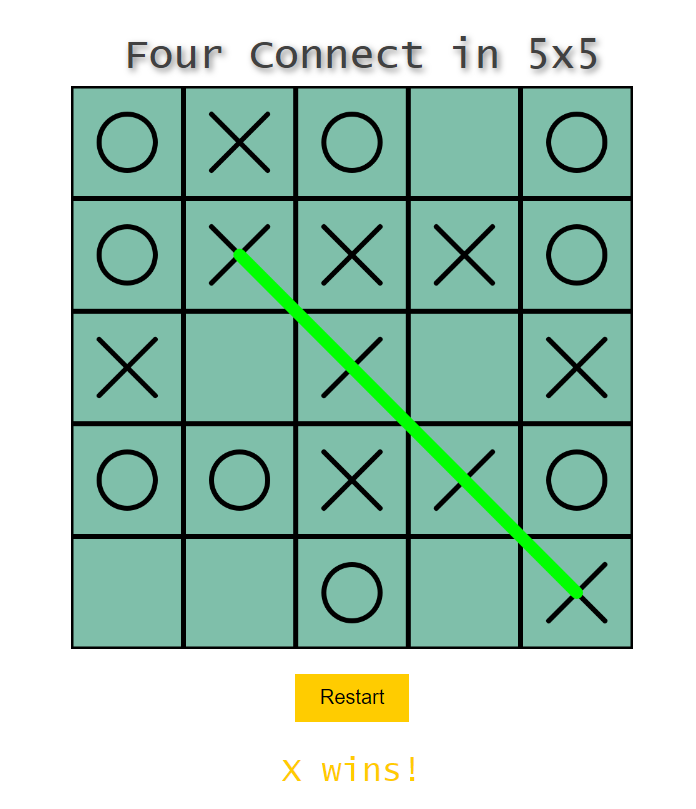
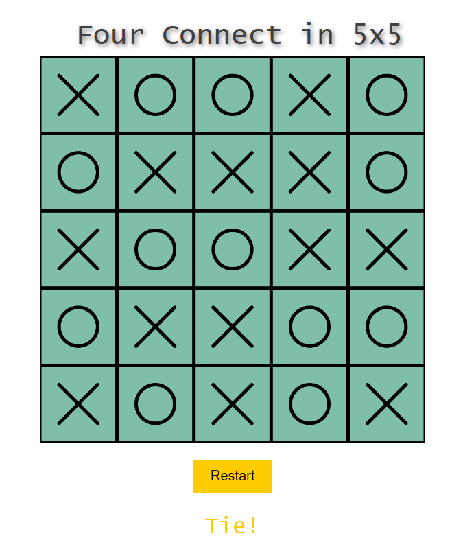

<h1>Four Connect in 5x5 board</h1>

<ol>
  <li style="list-style-type: disc;">Built a 5x5 Four Connect game using Minimax Search Algorithm by which an AI bot of the game finds best moves.</li>
  <li style="list-style-type: disc;">Used Alpha-beta pruning to decrease the number of nodes that are evaluated by the minimax algorithm in its search tree.</li>
  <li style="list-style-type: disc;">Optimised it using a heuristic evaluation function which reflects the potential of AI to win or block the opponent.</li>
  <li style="list-style-type: disc;">Tech Stack : HTML, Javascript, CSS</li>
</ol>
<h3>Here the results!</h3>

  

